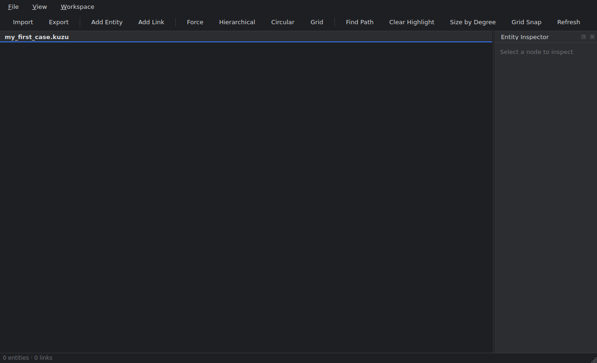
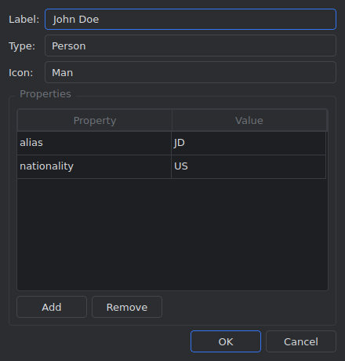
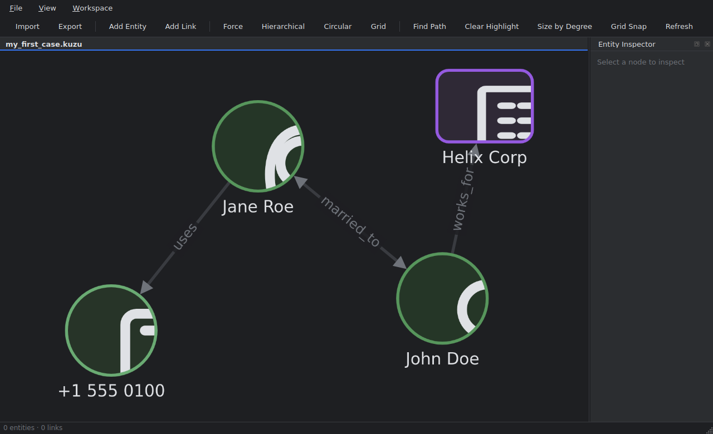
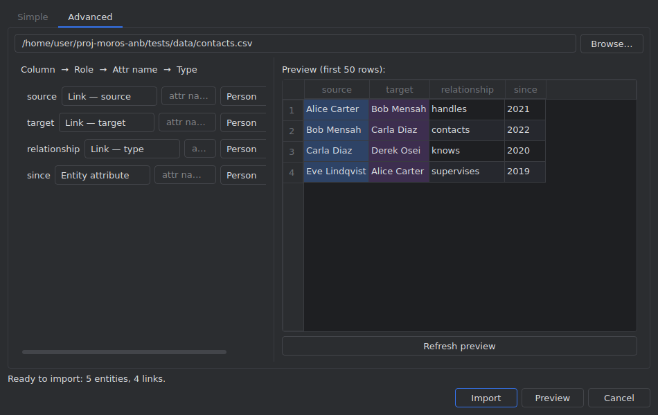
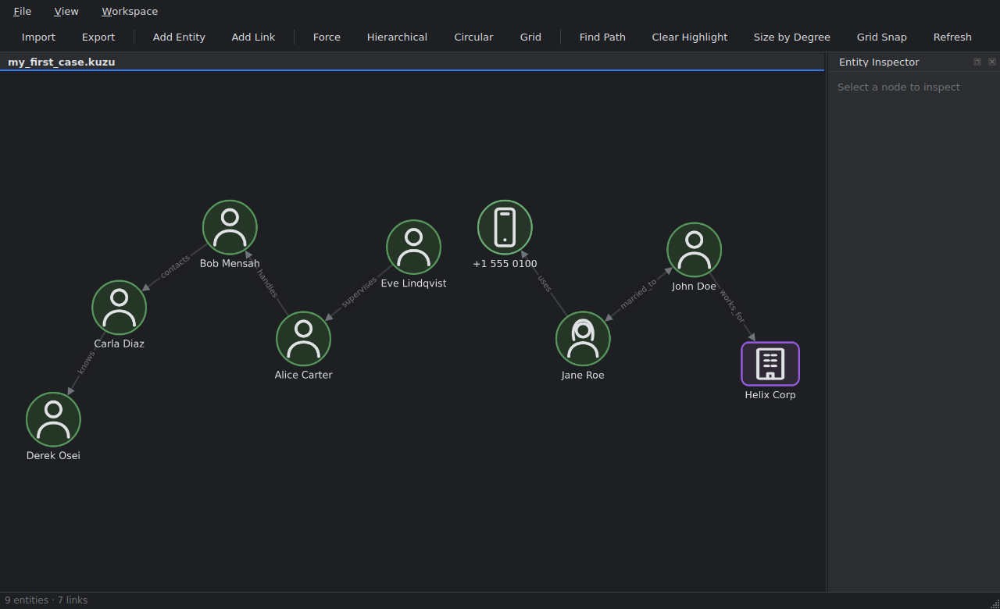
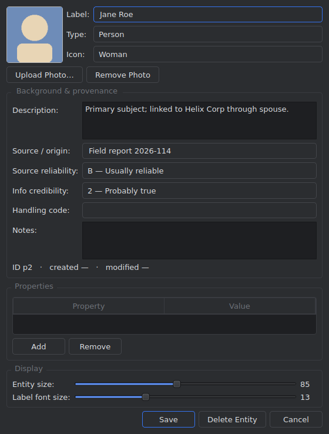
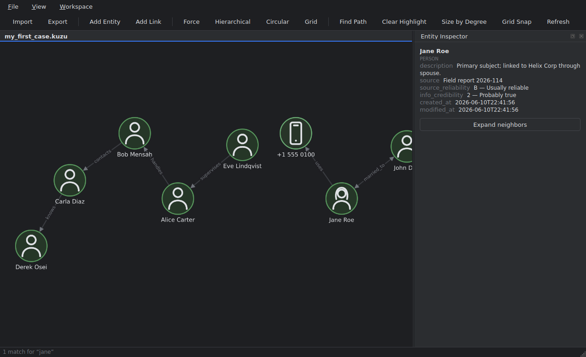
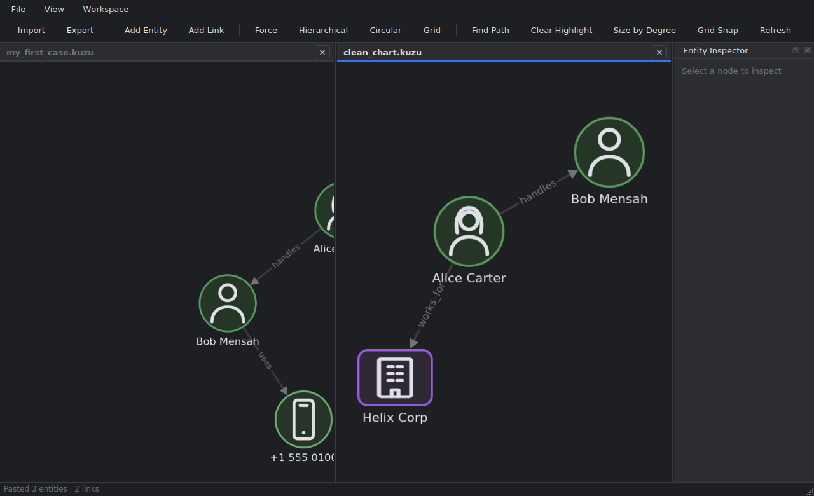
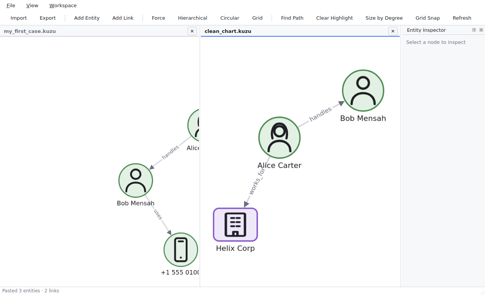

# mDiscovery — Quick Tutorial

A ten-minute tour of the app, from install to a finished, shareable chart.
Every screenshot below was captured from the real application.

---

## 0. Install & launch

```bash
git clone <repo> && cd proj-moros-anb
python3.11 -m venv .venv && source .venv/bin/activate
pip install -e ".[dev]"
mdiscovery
```

> Internet is needed on first launch (the canvas loads Cytoscape from a CDN).
> Cases are stored in `~/.mdiscovery/` by default. On Linux the app uses
> software rendering automatically for stability; force GPU with
> `MDISCOVERY_GPU=1` if you want it.

You'll land in an empty case. The window has four areas: the **toolbar**
(actions + search), the **workspace pane** (your chart canvas, titled with the
case name), the **Entity Inspector** dock (right), and the **status bar**
(entity/link counts and feedback messages).



---

## 1. Build a chart from nothing

Charts don't need imported data — every field is user-definable.

Click **Add Entity** on the toolbar. Give it a label, a semantic type, an
icon (Man, Woman, Organization, Group, Money, Cell Phone, IMSI, IMEI, Cell
Tower — or leave "(default for type)"), and any properties you want as
key/value rows.



Add a few entities, then **Add Link** to connect them: pick the two
endpoints, type the relationship label, choose a direction
(directed / undirected / bidirectional) and optional strength/confidence.



Drag nodes wherever you like — **positions are saved automatically** and
restored next time the case opens.

---

## 2. Import data (CSV / XLSX)

Click **Import…** on the toolbar.

- **Simple tab** — pick a file, choose which column is the entity label:
  every row becomes a standalone entity. Good for quick lists.
- **Advanced tab** — for *relationship* data. Map each column to a role:
  `source` → **Link — source**, `target` → **Link — target**,
  `relationship` → **Link — type**, extra columns → entity attributes.
  The preview colors each mapped column; **Preview** is an optional dry-run,
  and **Import** commits.



The result is a connected chart — entities merged by label+type, so
re-importing the same file never duplicates:



Other inputs: **File ▸ Import JSON…** (node-link format),
**File ▸ Import i2 Chart (ANX)…**, **File ▸ Import Case Package…** (`.onb`).

> Large cases: above 5,000 entities the app warns before drawing the whole
> chart — rendering may briefly freeze while the layout completes; that's
> normal, let the analysis finish (or Skip and Refresh later).

---

## 3. Rename a link in place

Click anywhere on a link: an inline editor opens at its midpoint. Type the
new label and press **Enter** or just click away — both commit. **Esc**
cancels. The rename is saved to the case immediately.


---

## 4. The Entity Dossier

**Double-click any entity** to open its dossier — the full i2-style record:

- **Photo** — Upload Photo… (shown on the node in place of the icon)
- **Background & provenance** — description, source/origin, the i2 grading
  trio (source reliability A–E, information credibility 1–5, handling code),
  notes, plus created/modified timestamps
- **Properties** — free key/value fields
- **Display** — per-entity node size and label font size sliders
- **Delete Entity** removes it and all its links



---

## 5. Find things

- **Search box** (toolbar, right): type part of a label, press Enter — the
  app searches the whole case (not just what's on screen), selects and zooms
  to matches; the status bar reports the count. Selecting a node shows its
  details in the **Entity Inspector**, where **Expand neighbors** pulls that
  node's connections into view.
- **Find Path** highlights the shortest chain between two entities.
- **Size by Degree** scales nodes by how connected they are.
- Layout buttons: **Force / Hierarchical / Circular / Grid**.



---

## 6. Grid vs free-flow movement

The **Grid Snap** toolbar toggle switches the canvas between free-flow
dragging and snap-to-grid placement (with a dot grid backdrop), per
workspace.


---

## 7. Multiple workspaces + copy/paste

**Workspace ▸ New Workspace** opens a second case side-by-side — e.g. raw
input on the left, the cleaned-up chart on the right. The **active** pane
(accented header) receives all toolbar actions.

Move data between panes by **copy/paste, not drag**: select nodes, then
**Workspace ▸ Copy Selection** (Ctrl+Shift+C), click the other pane,
**Paste** (Ctrl+Shift+V). Connections between copied entities come along;
pasting never overwrites entities that already exist in the target.



---

## 8. Light mode

**View ▸ Light Mode** switches the entire app — chrome, canvas, icons —
and remembers your choice.



---

## 9. Save, package, share

| Action | Where | What you get |
|---|---|---|
| Save Case As… | File | a copy of the working `.kuzu` case (+ photos) |
| Export Case Package… | File | **`.onb`** — single portable file: graph, layout, photos |
| Export… | toolbar | GraphML, CSV pair, node-link JSON, Markdown report, **i2 ANX** |
| Import Case Package / JSON / ANX | File | bring any of those back in |

The Markdown report includes graph statistics and key-broker (betweenness)
analysis. ANX targets i2 Analyst's Notebook's chart-XML format.

---

*That's the core loop: import or author → arrange (positions persist) →
enrich via dossiers → analyze (search, paths, degree) → package or export.*
